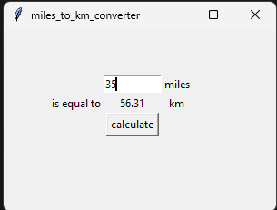

# Miles to Kilometer Converter

A simple GUI application built with Python and Tkinter that converts miles to kilometers.

This project helped me practise:
- Tkinter layouts
- labels
- entry widgets
- buttons
- event-driven programming
- `.get()`
- `.config()`
- rounding values
- and GUI spacing using padding

---

# Project Preview



---

# Features

- User enters miles value
- Button calculates conversion
- Result updates dynamically on the GUI
- Rounded kilometer output
- Clean layout using `grid()`
- Added window padding for better spacing

---

# Concepts I Practised

## Tkinter Widgets
- `Label`
- `Entry`
- `Button`

---

## Layout Management

Used:

```python
grid()
```

to position widgets using rows and columns.

---

## Event-Driven Programming

Used:

```python
command=action
```

to trigger the conversion function when the button is clicked.

---

## Getting User Input

Used:

```python
miles_box.get()
```

to retrieve the value entered by the user.

---

## Updating Labels Dynamically

Used:

```python
converted_num.config(text=converted_km)
```

to update the result displayed on the screen.

---

## Rounding Values

Used:

```python
round(value, 2)
```

to display cleaner kilometer results.

---

# What I Learned

This project helped me better understand how GUI applications work.

Instead of only writing scripts in the terminal, I learned how:
- widgets interact
- buttons trigger functions
- layouts are structured
- and how user input flows through a program

I also learned the importance of:
- readable variable names
- widget responsibilities
- and breaking projects into smaller logical steps.

---

# Technologies Used

- Python
- Tkinter