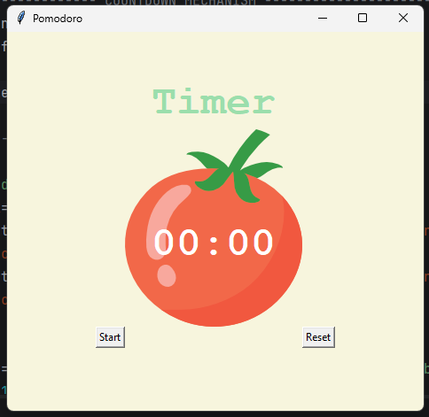
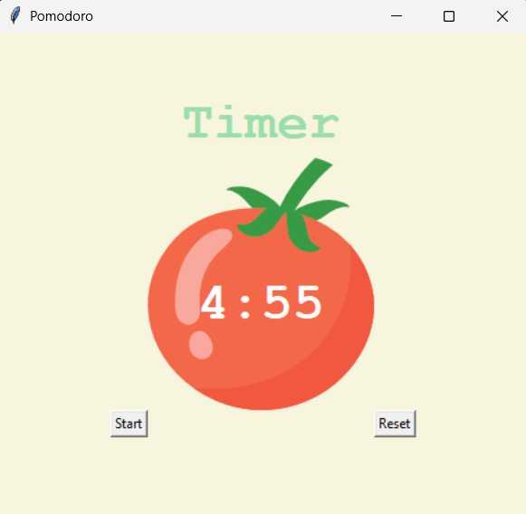
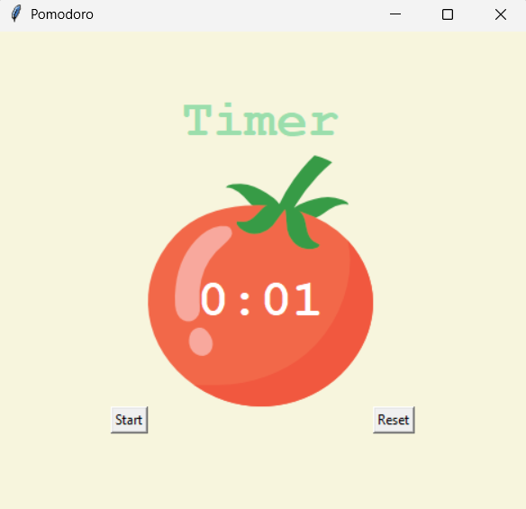
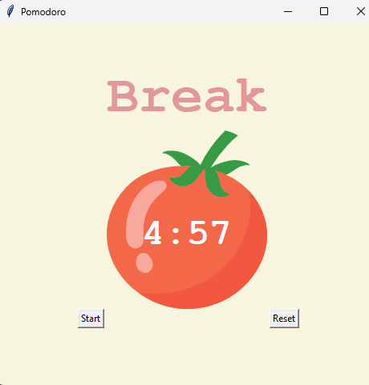

# Pomodoro Timer App

A Pomodoro Timer application built with Python and Tkinter.

This project is helping me learn how GUI applications work by combining:
- layouts
- buttons
- labels
- canvas widgets
- images
- and timer-based logic

The app is being built step by step as I learn more Tkinter concepts.

---

# Current Progress

## Completed UI Setup

So far, I have built:
- the main application window
- timer title label
- tomato image display
- countdown text
- start and reset buttons
- checkmark tracker
- grid-based layout
- themed background colours

---

# Project Preview

## Initial UI Layout



---

## Countdown Mechanism Added



---

## Improved Timer Formatting



---

# Concepts Practised

## Canvas Widget

Learned how to use:

```python
Canvas()
```

to create a layered GUI interface.

The canvas allows:
- images
- text
- and shapes

to be placed on top of each other.

---

## Working with Images

Used:

```python
PhotoImage(file="tomato.png")
```

to load and display images in Tkinter.

---

## Layering Text on Images

Used:

```python
canvas.create_text()
```

to place the timer text on top of the tomato image.

---

## Tkinter Layouts

Used:

```python
grid()
```

to organise widgets into rows and columns.

---

## Buttons and Commands

Used:

```python
Button(command=...)
```

to connect buttons to functions.

---

## Styling Widgets

Practised:
- `fg`
- `bg`
- `font`
- `padx`
- `pady`

to improve the appearance of the GUI.

---

## Canvas Positioning

Learned that:
- widgets outside the canvas use `grid()`
- objects inside the canvas use x and y coordinates

---

# Important Concepts Learned

- `Canvas`
- `PhotoImage`
- `create_image`
- `create_text`
- `highlightthickness=0`
- layering GUI elements
- widget positioning
- Tkinter styling
- event-driven programming

---

# Features Planned

The next features I plan to build include:
- countdown timer logic
- work and break sessions
- automatic timer updates
- reset functionality
- Pomodoro tracking
- dynamic checkmarks

---

# Technologies Used

- Python
- Tkinter
- Git
- GitHub

---

# What I’m Learning From This Project

This project is helping me improve:
- GUI thinking
- layout structuring
- debugging
- widget responsibilities
- and breaking large problems into smaller steps

I’m focusing on understanding how everything works instead of only copying code.
# Countdown Mechanism and Tkinter `after()` Method

## What I Learned

In this part of the Pomodoro project, I learned how countdown timers work in Tkinter GUI applications.

Instead of using a `while` loop with `time.sleep()`, Tkinter uses an event-driven system through:

```python
window.after()
```

This allows the GUI to continue running and responding to user interactions while updating the timer every second.

---

# Why `while` Loops Are Problematic in GUI Apps

Tkinter applications already run on a continuous loop using:

```python
window.mainloop()
```

This main loop constantly listens for:
- button clicks
- keyboard input
- screen updates
- and other events

Using another blocking loop like:

```python
while True:
```

can freeze the GUI.

---

# The `after()` Method

The solution is:

```python
window.after(milliseconds, function, arguments)
```

Example:

```python
window.after(1000, count_down, count - 1)
```

This means:
- wait 1000 milliseconds (1 second)
- then call `count_down()`
- and pass in `count - 1`

---

# Creating a Countdown

I learned how to repeatedly call a function without using a loop.

```python
def count_down(count):
```

The function:
1. updates the timer
2. waits 1 second
3. calls itself again with a smaller number

This creates a countdown effect.

---

# Converting Seconds into Minutes and Seconds

To display proper timer formatting, I learned how to convert seconds into:
- minutes
- remaining seconds

Using:

```python
math.floor(count / 60)
```

and:

```python
count % 60
```

Example:

```python
245 seconds
= 4 minutes and 5 seconds
```

---

# Updating Canvas Text Dynamically

For normal labels:

```python
label.config()
```

But for canvas elements:

```python
canvas.itemconfig()
```

Example:

```python
canvas.itemconfig(timer_text, text="4:59")
```

This updates the timer text directly on the canvas.

---

# Important Concepts Practised

- `window.after()`
- event-driven programming
- recursive countdown behaviour
- `math.floor()`
- modulo `%`
- dynamic GUI updates
- `canvas.itemconfig()`
- timer formatting
- countdown logic

---

# Project Progress

The Pomodoro timer can now:
- start a countdown
- update every second
- display minutes and seconds
- dynamically update the timer text on the canvas

---

# Pomodoro Session Switching Logic

## What I Learned

In this part of the project, I learned how to automatically switch between:
- work sessions
- short breaks
- long breaks

using logic and pattern detection with the modulo operator `%`.

---

# Understanding Reps

I created a global variable called:

```python
reps = 0
```

This variable keeps track of how many timer sessions have happened.

Each session counts as one repetition:
- work sessions
- short breaks
- long breaks

---

# Using Modulo for Pattern Detection

I learned that modulo is not only used for finding remainders.

It can also help detect patterns.

For example:

```python
reps % 2 == 0
```

checks if a number is even.

This helped me identify:
- short break sessions
- alternating timer behaviour

---

# Pomodoro Session Pattern

The Pomodoro cycle follows this pattern:

| Rep | Session |
|---|---|
| 1 | Work |
| 2 | Short Break |
| 3 | Work |
| 4 | Short Break |
| 5 | Work |
| 6 | Short Break |
| 7 | Work |
| 8 | Long Break |

---

# Session Switching Logic

I used conditional logic to decide which timer should run.

```python
if reps % 8 == 0:
```

starts the long break.

```python
elif reps % 2 == 0:
```

starts the short break.

Everything else becomes a work session using:

```python
else:
```

---

# Dynamic Label Updates

I also learned how to dynamically update labels using:

```python
label.config()
```

This allowed the app to:
- change the timer title
- update colours
- visually show the current session

Example:

```python
timer.config(text="Break", fg=RED)
```

---

# Important Concepts Practised

- modulo `%`
- pattern detection
- global variables
- conditional branching
- `if / elif / else`
- dynamic label updates
- GUI state management
- recursive timer cycling
- event-driven programming

---

# Project Progress

The Pomodoro timer can now:
- switch between work and break sessions
- automatically continue to the next session
- update timer colours dynamically
- visually show the current activity

---

# Updated Project Preview


