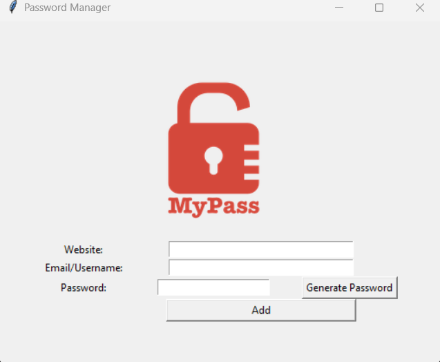

# Password Manager

A Tkinter project that recreates the user interface for a password manager application.

## What I Learned

### Canvas and Images

- Created a Canvas widget to display images.
- Loaded images using `PhotoImage`.
- Used `create_image()` to place an image on a canvas.
- Learned that image coordinates are based on the canvas size.
- Centered an image by placing it at half the canvas width and height.

### Grid Layouts

- Used `grid()` to position widgets.
- Organised widgets into rows and columns.
- Learned how to design a user interface using a grid system.

### Columnspan

- Learned how `columnspan` allows a widget to stretch across multiple columns.

Example:

```python
website_entry.grid(row=1, column=1, columnspan=2)
```

This allowed the Website and Email fields to span multiple columns.

### Entry Widgets

- Created text input fields using the `Entry` widget.
- Adjusted entry sizes using the `width` parameter.

### Buttons

- Added buttons using the `Button` widget.
- Positioned buttons inside the grid layout.

## Project Preview



## Progress Update

### Features Added

* Generate secure random passwords using letters, numbers, and symbols
* Automatically populate the password field with generated passwords
* Copy generated passwords directly to the clipboard using `pyperclip`
* Validate user input before saving
* Display warning messages when required fields are empty
* Confirm details with the user before saving
* Save website, email, and password information to a local data file

### Concepts Practised

* List comprehensions
* `random.choice()`
* `random.randint()`
* `random.shuffle()`
* `"".join()`
* Tkinter Entry methods:

  * `.get()`
  * `.insert()`
  * `.delete()`
* Tkinter Message Boxes:

  * `messagebox.showwarning()`
  * `messagebox.askokcancel()`
* File handling with append mode (`"a"`)
* Installing and using external packages (`pyperclip`)
* Using `.gitignore` to exclude sensitive files from version control

### Key Lessons Learned

* User input should be validated before processing or saving data.
* Functions connected to Tkinter buttons only run when the button is clicked.
* Variables created inside a function are only available within that function.
* List comprehensions can replace loops that build lists, making code shorter and more readable.
* Passwords and other sensitive user data should not be committed to Git repositories.
* `.gitignore` can be used to prevent files such as `data.txt` from being tracked by Git.

### Future Improvements

* Search for saved website credentials.
* Store data in JSON format instead of plain text.
* Improve password management and data organisation.
* Add additional validation and error handling.
